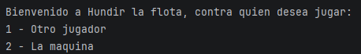
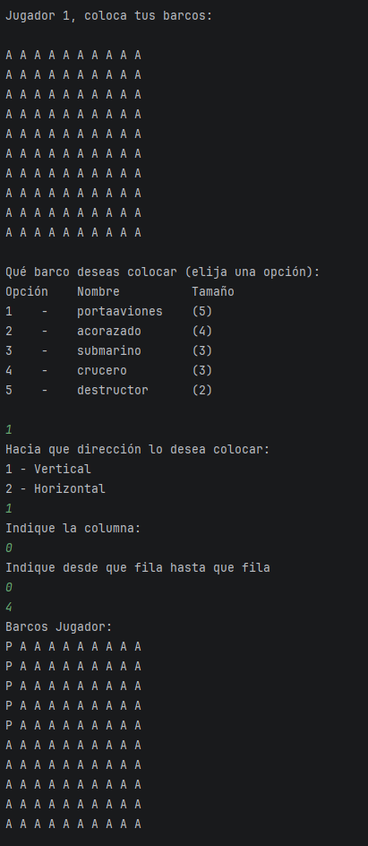
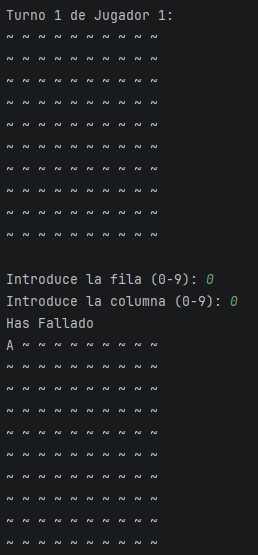

# Contexto
Proyecto de clase en el que teníamos que demostrar lo aprendido en diferentes métodos.

# Funcionalidades Principales
Elección de modo de juego, contra la máquina o contra otro jugador en el mismo jugador, colocar los barcos y atacar a una coordenada.

# Stack Tecnológico


# Capturas
## Menu Principal


## Colocación de Barcos


## Turno de Ataque


# Explicación de Ejecución
- JDK 25
- IDE con compilador de java

# Estructura
```txt
HundirLaFlota/
├── .idea/
│   ├── .gitignore
│   ├── misc.xml
│   ├── modules.xml
│   └── vcs.xml
├── src/
│   ├── Main.class
│   ├── Main.java
│   ├── Test.class
│   └── Test.java
├── .gitignore
├── README.md
└── Codigo.iml
```

# Decisiones Técnicas
- Se usa la libreria java.util.Scanner para recibir los inputs.
- Decidimos poner un limite de 200 turnos para que en caso de entrar en un bucle no colapse.
